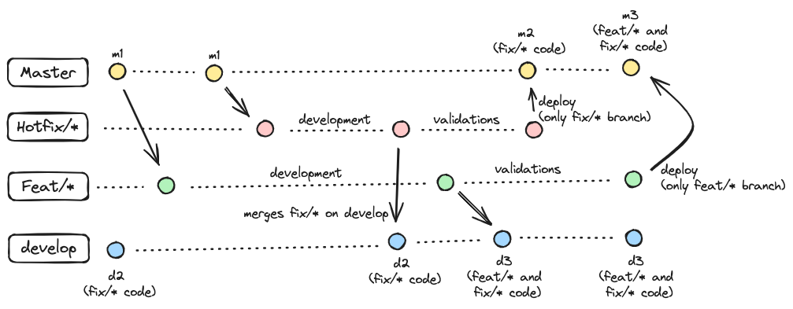

# Alternative Git Flow

Git Flow is a branching model for Git that helps teams manage their codebase and streamline the development process. It provides a set of guidelines and best practices for collaborating on a project using Git. The follows Git Flow is a alternative to independently deliveries. 

### Master Branch

The `master` branch represents the stable and production-ready code. It should always contain the latest release version of the project.

### Develop Branch

The `develop` branch is the branch for ongoing development and it is used as branch base to deploy on DEV environment. 

Alternatively, this git flow also can have the staging environment. Each branch base has an environment, but it keeps using master as base to create all other branches.

## Feature/Fix Branches

Feature branches are used to develop new features or enhancements for the project. They (feat and fix branches) should always be created from the `master`. They should be named descriptively, reflecting the feature or enhancement being developed.

## Here's an example of a workflow:

1. Creating the branches \
1.1 `git checkout master && git pull origin master` -> checkout and updates master branch locally \
1.2 `git checkout -b feat/branch-a`

...after development

2. Pull Request \
2.1 Open a pull request using `master` as base -> this pull request will still open until the deploy on PRD environment and the whole review will be done here (no reviews in other branches are needed) \
2.2 Ask for reviewers (recommendation: 2 approvals)

Once having two approvals, the developer can deploy their code on DEV environment and validate the code on a https environment

3. Deploy in `develop` \
3.1 `git checkout develop`\
3.2 `git pull origin feat/branch-a` -> notice: the code goes from `feat/branch-a` to `develop`, so `feat/branch-a` only has its code. Nothing more! \
3.3 `git push origin develop` \
3.4 deploy on DEV environment

Once everything goes right and validated, it's time to deploy on PRD

4. Deploy in `master` \
4.1 merge the pull request created on section `2` - master branch is updated \
4.2 Deploy on PRD environment

NOTE: 
Once all branches are created from master, every branch created has independently code. The key point to it is: \
3.1 `git checkout develop` \
3.2 `git pull origin feat/branch-a`

It means `feat/branch-a` updates `develop` branch and not the contrary. So even if `develop` has other code in (`feat/*`), `feat/branch-a` is not impacted for it.

See the image example: 

# Conflicts
... coming soon

# Credits
[felipefialho](https://github.com/felipefialho)
